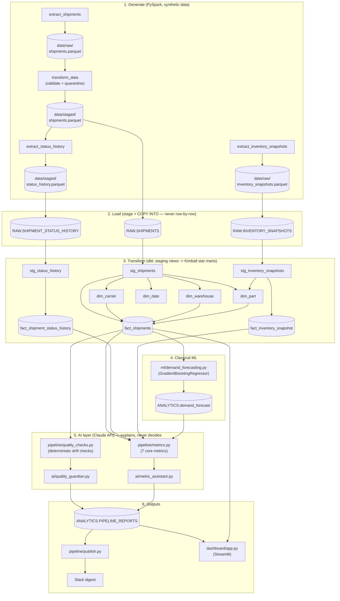

# Logistics AI Quality Guardian Pipeline

A batch data pipeline for a logistics/supply-chain domain, processing 1M+ shipment
records per run through Airflow, PySpark, Snowflake, and dbt — with an AI layer on
top that narrates data quality and business metrics, and a classical ML model for
demand forecasting.

This is Project 1 of a 4-project data engineering portfolio spanning batch,
micro-batch, streaming, and governance. See `portfolio_project_brief.md` (in the
parent directory) for the full portfolio context.

## Why this project exists

A working, realistic batch pipeline where AI plays two clearly-scoped roles:

1. **Pipeline health / quality guardian** — deterministic checks (row-count deltas,
   null-rate shifts, schema drift, new categorical values) catch problems; an LLM
   writes a plain-English health report.
2. **Supply-chain metric assistant** — SQL/dbt computes the 7 core logistics
   metrics; an LLM interprets them in natural language.

**Design principle: AI explains, deterministic logic decides.** The LLM never
gates the pipeline, never computes a number itself, and never sees raw rows —
it only narrates pre-computed dicts handed to it by deterministic Python/SQL.
This is intentional: LLMs hallucinate, so nothing that could break the pipeline
or corrupt a metric is allowed to depend on one.

## Architecture



## The 12-task Airflow DAG

| # | Task | What it does |
|---|---|---|
| 1 | `extract_shipments` | PySpark generates 1M+ synthetic shipment records → `data/raw/shipments.parquet` |
| 2 | `transform_data` | Validates/coerces types; splits valid rows from quarantined ones (>10% quarantine rate fails the task) |
| 3 | `extract_status_history` | Derives synthetic lifecycle events (created→picked→packed→shipped→out_for_delivery→delivered) per shipment |
| 4 | `extract_inventory_snapshots` | Generates daily inventory-on-hand per part × warehouse (500 SKUs × 5 warehouses × 730 days) |
| 5 | `load_to_snowflake` | Stages + `COPY INTO` → `RAW.SHIPMENTS` |
| 6 | `load_status_history_to_snowflake` | Stages + `COPY INTO` → `RAW.SHIPMENT_STATUS_HISTORY` |
| 7 | `load_inventory_to_snowflake` | Stages + `COPY INTO` → `RAW.INVENTORY_SNAPSHOTS` |
| 8 | `run_dbt_models` | `dbt build` — staging views + Kimball star marts + 45 data tests |
| 9 | `train_demand_forecast` | Trains a `GradientBoostingRegressor`, writes a 7-day-ahead forecast |
| 10 | `quality_guardian` | Deterministic drift checks (Role 1) → Claude API health report |
| 11 | `metric_assistant` | Queries the 7 core metrics (Role 2) → Claude API narrative |
| 12 | `publish_reports` | Pushes the run's AI reports + headline metrics to Slack |

## The 7 core supply-chain metrics

| # | Metric | Source |
|---|---|---|
| 1 | OTIF (on-time delivery) | `fact_shipments.is_on_time` |
| 2 | Shipment status transitions | `fact_shipment_status_history` — avg hours per stage |
| 3 | Inventory levels / stockouts | `fact_inventory_snapshot` — stockout rate at latest snapshot |
| 4 | Lead time / cycle time | `fact_shipments.lead_time_days` |
| 5 | Carrier performance & cost | `fact_shipments` × `dim_carrier` |
| 6 | Demand forecasting inputs | `ANALYTICS.demand_forecast` (ML model output) |
| 7 | Exceptions & disruptions | Delay rate overall + by carrier |

## Data model (Kimball star schema)

- **Fact tables**: `fact_shipments`, `fact_inventory_snapshot`, `fact_shipment_status_history`
- **Conformed dimensions**: `dim_carrier`, `dim_warehouse`, `dim_part`, `dim_date`

`dim_part` is a `UNION` across both `stg_shipments` and `stg_inventory_snapshots` —
not derived from shipments alone — because the inventory catalog (500 SKUs) is
wider than what shipments happen to reference. All foreign keys are verified with
dbt `relationships` tests (45 tests total, all passing).

## Repository structure

```
airflow/dags/logistics_pipeline.py   Thin DAG — imports + task wiring only, no logic
pipeline/
  config.py             Shared paths, constants, thresholds
  catalog.py             Shared deterministic (seeded) 500-SKU + warehouse catalog
  spark_utils.py          Shared get_spark() + PySpark interpreter fix
  snowflake_utils.py       Shared Snowflake connection + stage-and-COPY helper
  extract.py               extract_shipments
  transform.py             transform_data
  status_history.py        extract_status_history
  inventory.py             extract_inventory_snapshots
  load.py / load_inventory.py / load_status_history.py   Per-table Snowflake loaders
  dbt_runner.py            run_dbt_models (invokes `dbt build` as a subprocess)
  quality_checks.py        Deterministic drift checks + run-history table
  metrics.py               Computes all 7 core metrics via SQL
  reports.py               Persists/reads the AI reports in Snowflake
  notifications.py         Slack incoming-webhook sender
  publish.py               Builds the digest and posts it (final DAG task)
  drift_injector.py        CLI tool to deliberately break a batch
ai/
  claude_client.py         Thin wrapper around the Claude API
  quality_guardian.py       Role 1: narrates quality_checks output
  metric_assistant.py       Role 2: narrates metrics output
ml/
  demand_forecasting.py    Classical ML forecasting model (scikit-learn)
dashboard/
  app.py                   Streamlit dashboard (reads Snowflake directly)
logistics_dbt/
  models/staging/           Views: stg_shipments, stg_inventory_snapshots, stg_status_history
  models/marts/             Tables: dim_*, fact_* (Kimball star)
  profiles.yml              env_var()-based, no literal secrets — safe to commit
data/                      raw/ staged/ quarantine/ (gitignored — regenerated each run)
```

## Why the data is structured this way (design notes)

- **Parquet, not CSV** — columnar, compressed, type-preserving; required at this scale.
- **PySpark, not pandas** — bulk/vectorized generation; pandas doesn't scale to 1M+ rows/day.
- **Stage + `COPY INTO`, never row-by-row `INSERT`** — the only sane way to load
  millions of rows into Snowflake.
- **Shared, seeded part catalog** (`pipeline/catalog.py`) — `extract.py` (shipments)
  and `inventory.py` (stock snapshots) both draw from the *same* deterministic
  500-SKU list, so `dim_part` is a genuine foreign-key target for both fact
  tables, not two independently-random lists that happen to overlap.
- **Full-refresh, not incremental (for now)** — every run truncates and reloads.
  dbt incremental models + partitioning by load date is the natural next step
  once this needs to run daily against real accumulating history.

## Honest limitations

- **All data is synthetic**, generated by this project's own PySpark code — not
  pulled from a real external system or API. A real public dataset
  ([elevating-supply-chain-excellence](https://github.com/dumisanimagagula/elevating-supply-chain-excellence))
  was used as a schema reference for the inventory table, but its actual values
  were never imported — it was too small (a few thousand rows) to meet the 1M+
  requirement.
- **OTIF sits around ~37%**, which looks low — this is a property of how
  `extract.py` generates `actual_delivery_date` (skewed toward late by
  construction: 2 days of early slack vs. 5 days of late slack), not a bug in
  the OTIF calculation itself.
- **The status-transition "bottleneck" the AI narrates** (created→picked→packed→shipped
  all taking similar time) is an artifact of `status_history.py` evenly spacing
  synthetic event timestamps — the *mechanism* for surfacing bottlenecks is real
  and would work identically on real operational data, but the specific numbers
  aren't a genuine operational finding.
- **Metrics #2 and #3 needed new source tables to exist at all** — the original
  shipment schema had no transition-event log or inventory table; both were
  added specifically to close this gap.

## Setup

1. Create the venv and install dependencies:
   ```bash
   python3.12 -m venv airflow-env
   ./airflow-env/bin/python3 -m pip install -r requirements.txt
   ```
2. Create a `.env` in the project root with your own credentials — this file is
   gitignored; never commit real values:
   ```
   SNOWFLAKE_ACCOUNT=...
   SNOWFLAKE_USER=...
   SNOWFLAKE_PASSWORD=...
   SNOWFLAKE_WAREHOUSE=...
   SNOWFLAKE_ROLE=...
   ANTHROPIC_API_KEY=...
   SLACK_WEBHOOK_URL=...   # optional — Slack digest is skipped if absent
   ```
3. Source the environment:
   ```bash
   source start.sh
   ```
4. Run the DAG via the Airflow CLI, or trigger individual tasks for testing:
   ```bash
   airflow tasks test logistics_pipeline extract_shipments <date>
   ```

Set `LOGISTICS_RECORD_COUNT` (default `10000`) to control shipment volume for
faster local iteration — the full pipeline has been verified end-to-end at
`1000000`.

## Outputs

The AI reports don't just live in Airflow logs — each run persists them to
`ANALYTICS.PIPELINE_REPORTS` (one row per run per report type), which gives
both a durable history and a source for the two consumers below.

### Streamlit dashboard

```bash
streamlit run dashboard/app.py
```

Reads Snowflake directly, so it always reflects the latest completed batch —
no DAG task "refreshes" it. Shows the four headline metrics as tiles, both AI
narratives, the carrier table, per-stage timings, the demand forecast, and an
expandable history of previous health reports.

### Slack digest

The final DAG task (`publish_reports`) posts the headline metrics plus both AI
narratives to an incoming webhook. Set `SLACK_WEBHOOK_URL` in `.env`; if it's
absent the task logs the digest and skips sending, so the DAG doesn't fail on
machines where notifications aren't configured.

## Docker

```bash
docker compose up
```

Builds the full environment (Python 3.12 + Java 17 for PySpark + all
dependencies) and runs `airflow standalone` on port 8080 (admin credentials
printed in the logs on first boot). Source directories are live-mounted, so
code edits don't require a rebuild. Credentials come from your local `.env`
via `env_file` — they're never baked into the image.

## CI

GitHub Actions (`.github/workflows/ci.yml`), three jobs:

- **lint-and-check** (every push): `ruff` across all Python packages + DAG syntax check
- **dbt-parse** (every push): validates the entire dbt project — SQL syntax,
  refs, configs — using dummy credentials, no Snowflake connection needed
- **dbt-build** (manual trigger only): full `dbt build` with real tests against
  Snowflake, using repository secrets — kept off the push path so routine
  commits don't burn warehouse credits

## Schema-drift injector

Deliberately breaks `RAW.SHIPMENTS` to prove the quality guardian catches real
failures (and, later, to trigger Project 2's root-cause agent):

```bash
python -m pipeline.drift_injector null_spike --column carrier_name --fraction 0.15
python -m pipeline.drift_injector schema_drop_column --column promised_delivery_date
python -m pipeline.drift_injector revert
```

Scenarios: `row_count_drop`, `null_spike`, `new_status`, `schema_drop_column`
(destructive), `schema_add_column` (additive), `revert`. The
additive-vs-destructive distinction is deliberate — it's the safe-to-auto-fix
vs. needs-a-human boundary Project 2 is built around.

## Status

All 12 DAG tasks are implemented and have been verified end-to-end through the
real Airflow scheduler at 1M+ record scale.
